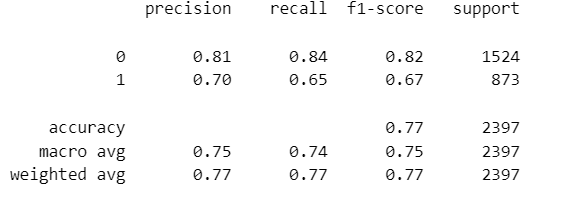

# Customer churn prediction

This project presents an analysis of customer churn for a telecom company. Our goal is to support the company in reducing churn through two main actions:

>- Identify customers at high risk of churn so they can be contacted proactively
>- Propose personalized discounts that help retain customers while remaining competitive

Tools and Technologies  : 

>- Python (Pandas, Scikit-learn, Seaborn, plotly)
>- Git for version control; 
>- FastAPI for model deployment
>- Docker for containerization

# Analysis Plan

## 1-) **Dataset Exploration, visualisation and preprocessing :**

We began with an exploratory analysis to understand the dataset's features and identify key patterns.

**Variables description**
CUSTOMER_ID : A technical unique identifier

COLLEGE : Is the customer college educated?

DATA : Monthly consumption of data (in Mo)

INCOME: Annual income (salary) of the client 

OVERCHARGE : Average overcharge per year 

LEFTOVER : Average number of lefover minutes per month  

HOUSE : Estimated value of dwelling (from census tract)

LESSTHAN600k : Is the House value smaller or higher than 600k? 
 
CHILD : Number of children 

JOB_CLASS : Self reported type of job 
 
REVENUE : Annual phone bill (excluding Overcharge) 

HANDSET_PRICE : Cost of phone 

OVER_15MINS_CALLS_PER_MONTH : Average number of long calls (>15 mins) per month 

TIME_CLIENT : Tenure in years

AVERAGE_CALL_DURATION : Average duration of a call 
 

REPORTED_SATISFACTION : Reported level of satisfaction

REPORTED_USAGE_LEVEL : Self reported usage level 
 
CONSIDERING_CHANGE_OF_PLAN : Self reported consideration whether to change operator

CHURNED : Did the customer stay of leave
 

**Preprecessing steps included:**
>- Replacing string values with integers for modeling
>- Filling missing values with median (for numerical features) or most frequent values (for categorical features)

NB : A complete statistical analysis is also availble in the notebooks folder.

## 3-) **Machine Learning Models:**

We decided to try 4 models : Logistic Regression, Random Forest, XGBoost and LGBM
The best performance was achieved by XGboost model with the following results :

This model did the best results in general and also in the positive class (CHURN = 1) which is our main focus.

## 4-) **Deployment Code**

After selecting our best model, we prepared it for deployment using:
>- FastAPI to serve predictions through an API
>- Docker to containerize the entire project

# State of the Project : 

We are currently working on: 
>- A module that proposes personalized discounts based on churn probability
>- Implementation of unit tests
>- Full Docker containerization

If you have any questions or suggestions, feel free to reach me out : Mayene2212@gmail.com